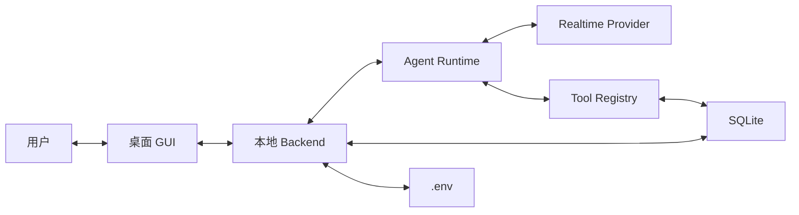

# voiceAgent MVP 设计计划

## 1. 产品定位

`voiceAgent` 是一款只推荐本地运行、开源、面向非技术用户的 AI 语音代理应用。

用户可以通过桌面 GUI 配置 API Key、商家资料、系统提示词、语音、工具和运行状态；API Key 存储在本地 `.env` 文件中，并可以从前端设置页修改保存。第一版先支持通过麦克风和扬声器测试实时语音对话，后续再接入电话服务，让客户拨打指定号码后进入商家的 AI Voice Agent。

一句话定位：

> 给本地商家使用的 AI Voice Agent 控制台：填资料、选语音、开工具、点运行。

## 2. MVP 目标

第一版要让用户完成以下核心流程：

- 下载项目后可以一键启动本地应用。
- 在 GUI 中填写并保存 OpenAI / Gemini provider API Key 到本地 `.env`。
- 选择语音 provider 和 voice。
- 填写商家资料文本。
- 编辑或使用预设 system prompt。
- 启用或关闭内置工具。
- 点击运行后启动本地后台程序，让应用进入等待测试或电话呼入的状态。
- 通过麦克风和 AI 实时语音对话，单次测试或通话 session 最长 5 分钟。
- 查看 transcript、tool calls 和 runtime logs。
- 按 24h、7days、30days 等时间范围查看历史记录。

## 3. 第一版不做什么

为了保证 MVP 能尽快完成，以下能力先不进入第一版主线：

- 完整电话 provider 接入。
- 云端托管运行。
- 云端多租户后台。
- 超过 5 分钟的长对话 session。
- 复杂 CRM / PMS / booking 系统。
- 所有 STT / LLM / TTS provider 的完整矩阵。
- 向量数据库和复杂 RAG。
- 企业级登录、权限和团队管理。
- 本地模型性能优化。

第一版重点是把本地实时语音闭环、配置体验、工具调用和日志系统做稳。

## 4. 目标用户

主要用户：

- 小型商家老板或运营人员。
- 不一定懂技术。
- 想要一个 AI 前台、AI 订房助手、AI 客服或 AI 电话接待员。
- 能接受复制粘贴 API Key。
- 希望界面清楚、状态明显、日志可读。

次要用户：

- 开源开发者。
- 系统集成商。
- 想扩展 provider、tools、phone adapter 或业务模板的人。

## 5. 核心用户旅程

1. 用户下载并启动桌面应用。
2. 用户进入 `Settings` 填写 API Key，应用写入本地 `.env`。
3. 用户进入 `Business Info` 粘贴商家资料。
4. 用户进入 `Agent` 编辑或选择预设 system prompt。
5. 用户进入 `Voice` 选择 provider 和 voice。
6. 用户进入 `Tools` 启用 booking、business info lookup、transfer call 等工具。
7. 用户点击 `Start` 启动本地后台程序。
8. 用户进入 `Test Call`，直接用麦克风和 AI 对话，每次最多 5 分钟。
9. 用户进入 `Logs` 查看 transcript、tool calls 和错误日志。
10. 后续版本中，用户填写电话 provider 信息，把同一个 Agent 接入真实电话。

## 6. 推荐总体架构

第一版以 Realtime Mode 为主线，同时接入 OpenAI Realtime 和 Gemini Live。Pipeline Mode 作为第二方案，只预留接口和目录结构，不进入 MVP 主开发路径。



核心原则：

- GUI 不直接调用模型 provider。
- 本地 backend 负责 session、`.env` config、tools、logs。
- Agent Runtime 负责对话状态和 provider 事件流。
- Tools 通过统一 registry 暴露给 Agent。
- SQLite 负责轻量本地数据存储。
- 24/7 运行指后台程序常驻，不代表 AI realtime session 长时间不断开。

## 7. Runtime 模式设计

### 7.1 Realtime Mode

MVP 主路线，同时支持 OpenAI Realtime 和 Gemini Live。

```text
Mic Test / Incoming Phone Call
  -> Create 5-minute Realtime Session
  <-> Realtime API
  <-> Agent Runtime
  <-> Tools
  <-> SQLite / Local Files
  -> End Session
```

这个模式下 Python app 只做薄后端：

- session 管理。
- 从 `.env` 加载 provider API Key。
- provider 连接生命周期。
- tool callback 路由。
- transcript 和日志保存。
- health check 和状态上报。
- 单次 session 5 分钟超时中断。

第一批 provider：

- OpenAI Realtime。
- Gemini Live。

### 7.2 Pipeline Mode

第二方案，MVP 只预留，不实现完整链路。

```text
Audio Input
  -> STT
  -> LLM
  -> Tools
  -> TTS
  -> Audio Output
```

未来可支持：

- STT：Whisper local、Deepgram、OpenAI transcription。
- LLM：OpenAI、Claude、Gemini、Ollama。
- TTS：ElevenLabs、OpenAI TTS、Edge TTS、Piper、indextts2。

Pipeline Mode 的价值：

- 降低成本。
- 支持本地模型。
- 支持更多 provider 组合。
- 作为 Realtime provider 不可用时的 fallback。

但它不应该阻塞第一版 Realtime MVP，也不进入第一版默认 UI。

## 8. 会话生命周期设计

后台程序和 AI 对话 session 必须拆开。

后台程序：

- 可以 24/7 常驻运行。
- 负责读取配置、等待麦克风测试或电话呼入、记录日志。
- 不应该长期占用 realtime 模型连接。

AI 对话 session：

- 由用户点击 `Test Call` 或未来电话呼入触发。
- 每次最长运行 5 分钟。
- 到达 5 分钟时自动结束 session。
- 结束时保存 transcript、tool calls、session status 和结束原因。
- 用户或来电方重新发起时创建新的 session。

Session 结束原因：

```text
user_stopped
caller_hung_up
timeout_5_minutes
provider_error
network_error
backend_shutdown
```

## 9. 推荐技术栈

### 9.1 桌面端

固定使用：

- Tauri + React + Vite。
- shadcn/ui。
- Tailwind CSS。
- 组件风格遵循 `DESIGN.md`。

优点：

- 打包体积小。
- 跨 macOS / Windows。
- 适合本地工具型开源应用。

### 9.2 本地后端

推荐：

- Python。
- FastAPI。
- WebSocket / local HTTP。
- Pydantic。
- SQLite。
- provider adapter。
- tool registry。

### 9.3 打包方式

MVP：

- 桌面端启动本地 Python backend 子进程。
- 开发环境先保证一键启动。
- 发布时再做 macOS / Windows 安装包。

后续：

- macOS 签名。
- Windows installer。
- 自动更新。

## 10. 推荐项目结构

```text
app/
  desktop/
    src/
    public/
    package.json
  backend/
    api/
    core/
    providers/
    tools/
    storage/
    config/
    logs/
  .env.example
  docs/
```

模块职责：

- `desktop`：GUI、状态展示、配置表单、日志界面。
- `api`：本地 HTTP / WebSocket 接口。
- `core`：Agent Runtime、session、状态机。
- `providers`：OpenAI、Gemini、未来 phone/audio provider。
- `tools`：工具注册、schema、handler。
- `storage`：SQLite、migration、查询封装。
- `config`：本地配置、profile、`.env` 读写。
- `logs`：结构化日志和 log rotation。

## 11. Provider Adapter 设计

所有模型 provider 应该统一成 adapter 接口。

```text
ProviderAdapter
  - validate_config(config)
  - list_voices()
  - start_session(agent_config)
  - send_audio(chunk)
  - send_text(message)
  - handle_event(event)
  - close_session()
```

不同 provider 的事件要归一化成内部事件：

```text
agent.started
agent.stopped
agent.error
audio.input_started
audio.output_started
transcript.partial
transcript.final
tool.call_started
tool.call_completed
tool.call_failed
```

这样 GUI 不需要理解 OpenAI、Gemini 或未来 provider 的底层差异。

## 12. Tool System 设计

工具应该以 registry 方式管理。

每个 tool 定义：

- `name`
- `description`
- `input_schema`
- `enabled`
- `handler`
- `human_readable_result`
- `failure_message`

第一版内置工具：

- `business_info_lookup`：从商家资料文本中查询信息。
- `create_booking`：创建 booking 记录，先写入 SQLite。
- `transfer_call`：第一版先记录转接意图，电话接入后再执行真实转接。
- `log_customer_request`：记录客户需求、回电请求、未解决问题。

工具调用规则：

- 输入必须经过 schema validation。
- 每次调用必须写入 `tool_calls`。
- 失败时必须返回安全、清楚的错误信息。
- 不可逆操作后续应加入确认机制。

## 13. 本地数据存储设计

MVP 使用 SQLite 即可。

建议表：

```text
settings
agents
business_profiles
sessions
messages
transcripts
tool_calls
bookings
app_logs
```

关键表字段：

```text
sessions
  id
  provider
  mode
  started_at
  ended_at
  status
  error_message

messages
  id
  session_id
  role
  content
  created_at

tool_calls
  id
  session_id
  tool_name
  input_json
  output_json
  status
  started_at
  ended_at
  error_message
```

商家资料存储：

- 短文本：直接存在 SQLite。
- 中等文本：SQLite 或本地 markdown/text 文件。
- 很长资料：未来再考虑简单检索或向量数据库。

第一版不需要上来就做复杂 RAG。

## 14. API Key 和配置设计

本项目只推荐本地运行。MVP 中 API Key 存储在本地 `.env` 文件里，不放入 SQLite，不上传云端，不提交到 git。

推荐文件：

```text
.env
.env.example
```

`.env.example` 示例：

```text
OPENAI_API_KEY=
GEMINI_API_KEY=
DEFAULT_REALTIME_PROVIDER=openai
DEFAULT_VOICE=
```

规则：

- 前端设置页可以修改 API Key。
- 前端不直接写文件，通过本地 backend API 保存 `.env`。
- backend 启动时读取 `.env`。
- 保存后 backend 可以重新加载 provider config。
- `.env` 必须加入 `.gitignore`。
- UI 需要提示用户：此项目设计为本地运行，不建议暴露在公网服务器。

配置拆分：

- provider secrets：`.env`。
- agent profile。
- business profile。
- tool settings。
- runtime preferences。

## 15. UI 信息架构

主导航建议：

- Dashboard
- Agent
- Voice
- Business Info
- Tools
- Test Call
- Logs
- Settings

Dashboard 第一屏必须回答：

- 后台程序现在有没有运行？
- 当前是否有活跃 AI session？
- 当前使用哪个 provider？
- 当前 voice 是什么？
- 必要配置是否完整？
- 最近一次错误是什么？
- 最近有哪些 transcript 和 tool call？

推荐布局：

```text
Left Sidebar
  Dashboard
  Agent
  Voice
  Business Info
  Tools
  Test Call
  Logs
  Settings

Main Surface
  后台运行状态
  当前 session 状态
  Start / Stop
  Provider 和 voice
  5 分钟 session 倒计时
  最近 transcript
  最近 tool calls

Right Inspector / Drawer
  详细配置
  错误详情
  当前 session 信息
```

视觉方向：

- 遵循 `DESIGN.md`。
- 保留 premium、voice-native、dark neon 的整体风格。
- App 主界面要偏控制台，不要做成纯营销落地页。
- 使用 waveform、transcript、speaking state、voice controls 等语音原生元素。
- 错误提示必须清楚，适合非技术用户理解。

## 16. 长时间运行稳定性设计

用户希望后台程序 24/7 运行，但 AI 对话 session 只在测试或电话呼入时启动，且每次最多 5 分钟。因此稳定性设计重点是后台常驻、按需创建 session、超时释放连接。

MVP 应包含：

- 明确的 Agent 状态机。
- provider 重连策略。
- session 过期处理。
- 5 分钟 session timeout。
- backend health check。
- 结构化错误消息。
- log rotation。
- transcript 和 tool call 增量保存。
- UI 状态指示。

后台状态：

```text
stopped
starting
standby
degraded
stopping
error
```

Session 状态：

```text
idle
starting
running
reconnecting
stopping
stopped
timeout
error
```

## 17. 电话服务接入预留

电话 provider 不应该直接耦合到 Agent Runtime。

未来结构：

```text
Phone Provider
  <-> Phone Adapter
  <-> Audio Stream Interface
  <-> Agent Runtime
```

可能 provider：

- Twilio。
- Telnyx。
- SIP provider。

MVP 需要提前准备：

- 抽象 audio input / output。
- 麦克风测试和电话流使用同一套 runtime interface。
- 电话呼入时才创建 realtime session。
- 电话或测试 session 最长 5 分钟。
- `transfer_call` 第一版只记录 intent，后续再接电话 provider。

## 18. 里程碑计划

### Milestone 0：项目基础

- [ ] 使用 Tauri + React + Vite 创建桌面端项目结构。
- [ ] 接入 shadcn/ui。
- [ ] 接入 Tailwind CSS。
- [ ] 创建 Python backend 项目结构。
- [ ] 添加本地启动脚本。
- [ ] 添加 `.env.example`。
- [ ] 确保 `.env` 在 `.gitignore` 中。
- [ ] 添加基础文档。

### Milestone 1：Realtime Voice Loop

- [ ] 实现 OpenAI Realtime provider adapter。
- [ ] 实现 Gemini Live provider adapter。
- [ ] 支持麦克风输入。
- [ ] 支持扬声器输出。
- [ ] 展示 provider 连接状态。
- [ ] 支持 start / stop session。
- [ ] 实现 5 分钟 session timeout。
- [ ] 保存原始 session log。

### Milestone 2：Agent 配置

- [ ] API Key 设置页。
- [ ] 前端通过 backend API 保存 `.env`。
- [ ] backend 从 `.env` 加载 OpenAI / Gemini API Key。
- [ ] Voice selector。
- [ ] System prompt editor。
- [ ] Business info editor。
- [ ] 将配置加载进 realtime session。

### Milestone 3：Tools

- [ ] 实现 tool registry。
- [ ] 实现 `business_info_lookup`。
- [ ] 实现 `create_booking`。
- [ ] 实现 `transfer_call` placeholder。
- [ ] 实现 tools 开关界面。
- [ ] 所有 tool calls 写入 SQLite。

### Milestone 4：Logs And History

- [ ] SQLite migration。
- [ ] sessions 持久化。
- [ ] transcripts 持久化。
- [ ] tool calls 持久化。
- [ ] logs 页面。
- [ ] 支持 24h、7days、30days 筛选。

### Milestone 5：稳定性

- [ ] provider reconnect。
- [ ] degraded / error 状态展示。
- [ ] 后台 standby 状态。
- [ ] session timeout 结束原因记录。
- [ ] backend health check。
- [ ] log rotation。
- [ ] macOS packaging smoke test。
- [ ] Windows packaging smoke test。

### Milestone 6：电话接入预览

- [ ] 定义 phone adapter interface。
- [ ] 添加 phone provider settings 页面。
- [ ] 做 Twilio 或 Telnyx proof of concept。
- [ ] 将电话 audio stream 接入现有 Agent Runtime。
- [ ] 将 `transfer_call` placeholder 变成真实 provider action。

## 19. 测试计划

手动测试：

- 从干净环境启动应用。
- 在前端保存 API Key，确认 `.env` 被正确更新。
- 重启 backend，确认 API Key 从 `.env` 正确加载。
- 启动 microphone test session。
- 验证 OpenAI Realtime session。
- 验证 Gemini Live session。
- 验证单次 session 到 5 分钟自动中断。
- 询问商家资料问题。
- 触发 booking tool。
- 触发 transfer call placeholder。
- 停止 session。
- 重启 app 后查看 transcript history。
- 模拟 API Key 错误。
- 模拟网络断开。

自动化测试：

- config validation。
- `.env` read / write。
- tool schema validation。
- SQLite migration。
- provider event normalization。
- Agent state machine。
- 5-minute session timeout。
- UI primary screen smoke tests。

## 20. 主要风险

### 延迟

风险：

- Pipeline Mode 链路长，容易影响实时语音体验。

应对：

- 第一版优先 Realtime Mode。
- 避免 backend 做不必要音频处理。

### Provider 不稳定

风险：

- 不同 provider 事件格式、重连机制、session 生命周期不一致。

应对：

- 用 provider adapter 归一化。
- UI 只消费内部标准事件。

### 24/7 运行

风险：

- 如果把 24/7 理解成 realtime session 长连接，会遇到断网、provider session 过期、内存堆积、日志过大等问题。

应对：

- 24/7 只代表后台程序常驻。
- 每次测试或电话呼入才创建 AI session。
- 单次 session 最长 5 分钟。
- 增量保存 transcript 和 tool calls。
- 做状态机、重连和 log rotation。

### API Key 本地存储

风险：

- `.env` 是本地明文文件，不适合云端部署或多人服务器部署。

应对：

- 项目文档明确只推荐本地运行。
- `.env` 加入 `.gitignore`。
- UI 提醒用户不要共享项目目录或把 `.env` 提交到 git。

### 范围膨胀

风险：

- 同时支持太多 provider 会拖慢 MVP。

应对：

- MVP 只完成 OpenAI Realtime 和 Gemini Live。
- Pipeline Mode 只保留架构接口。

## 21. 第一 Sprint 建议

第一 Sprint 只做最小闭环：

- 最小桌面壳。
- Tauri + React + shadcn/ui + Tailwind CSS 基础界面。
- 本地 backend 子进程。
- `.env.example` 和 `.env` 读写。
- OpenAI Realtime session start / stop。
- Gemini Live session start / stop。
- 麦克风输入。
- 扬声器输出。
- 5 分钟 session timeout。
- 一个硬编码 system prompt。
- 一个 mock tool。
- 基础 transcript 展示。
- session log 本地保存。

成功标准：

- 用户可以启动 app，在前端保存 API Key，点击 start 让后台进入 standby，启动一次最多 5 分钟的测试对话，开口说话，听到 AI 回复，触发一个工具，停止或超时结束 session，并在界面里看到 transcript。
