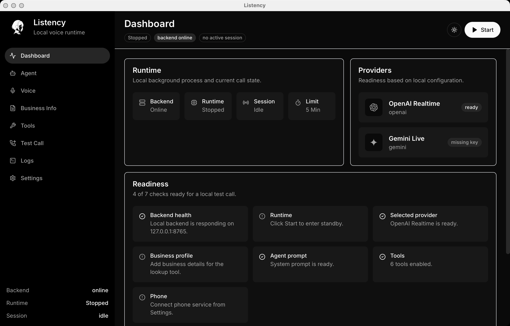
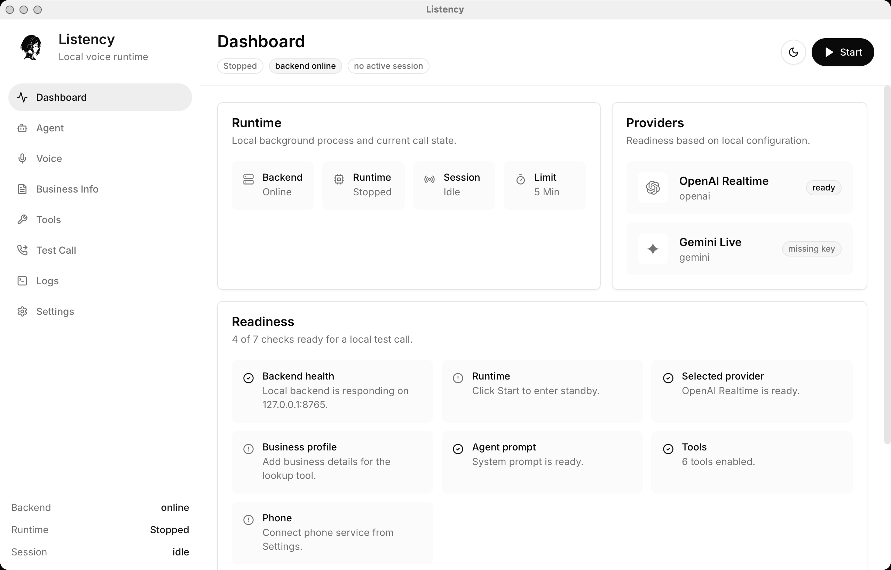

<p align="center">
  
</p>

<h1 align="center">Listency</h1>

<p align="center">
  Local-first desktop app for building and testing AI voice agents for small businesses.
</p>

<p align="center">
  
  <a href="https://github.com/Talen-520/Listency/actions/workflows/windows-packaged-smoke.yml">
    
  </a>
  <a href="https://github.com/Talen-520/Listency/actions/workflows/macos-packaged-smoke.yml">
    
  </a>
  <a href="https://github.com/Talen-520/Listency/actions/workflows/release-draft.yml">
    
  </a>
  <a href="https://github.com/Talen-520/Listency/releases">
    
  </a>
  
  
  
</p>

Listency gives a small business owner a local control panel for voice agents:
save provider keys, enter business information, choose a voice, enable tools,
test with a microphone, connect a phone number, and review transcripts or tool
calls afterward.

## What Is Listency?

Listency is a local-first Tauri desktop app with a thin Python backend. Packaged
builds start the backend sidecar automatically and stop it when the app closes.
No hosted Listency server is required for the current alpha.

The current realtime path supports:

- OpenAI Realtime with `gpt-realtime-2`
- Gemini Live with `gemini-3.1-flash-live-preview`
- Twilio inbound phone calls through an automatic cloudflared tunnel
- Local tools for business lookup, booking capture, transfer requests, customer
  request logging, and AI-ended calls

## Interface Preview

<details open>
  <summary><strong>Dark Theme</strong></summary>
  <br />
  <a href="assets/dark.png">
    
  </a>
</details>

<details>
  <summary><strong>Light Theme</strong></summary>
  <br />
  <a href="assets/light.png">
    
  </a>
</details>

## Current Status

Listency is in early alpha.

What works today:

- Local packaged macOS and Windows desktop builds
- Auto-started backend sidecar in packaged builds
- OpenAI Realtime and Gemini Live microphone test calls
- Provider voice selection and cached voice previews
- Local `.env` configuration and SQLite logs
- 24h / 7 days / 30 days logs, session detail, JSON export, prune, and clear
- Twilio paid-account inbound call testing through automatic tunnel provisioning
- Release Draft workflow with artifacts, checksums, and optional signing gates

Still in progress:

- Public signed macOS and Windows releases
- Longer phone-provider stability testing
- Production-ready phone failure recovery
- Pipeline mode with separate STT, LLM, and TTS providers
- More complete booking workflows

## Quick Start

For alpha users:

1. Download a packaged Listency build from
   [GitHub Releases](https://github.com/Talen-520/Listency/releases).
2. Open the desktop app.
3. Add OpenAI and/or Gemini API keys in Settings.
4. Choose a provider, model, and voice.
5. Fill in Business Info and Agent prompt.
6. Enable the tools the agent should use.
7. Start Runtime, then use Test Call to speak with the agent.
8. Optional: configure Twilio in Settings, choose Connect Phone, and call the
   configured number.
9. Review transcripts, tool calls, phone outcomes, and app events in Logs.

Packaged builds include the backend sidecar and cloudflared connector, so users
do not need Python, Node, pnpm, Rust, cloudflared, or a terminal.

For developers:

```bash
cd app/backend
python3 -m venv .venv
source .venv/bin/activate
pip install -r requirements.txt

cd ../desktop
corepack enable
pnpm install
pnpm run tauri:dev
```

See [Development](docs/DEVELOPMENT.md) for the full local workflow.

## Features

- Local-first desktop runtime with a lightweight FastAPI backend.
- OpenAI Realtime and Gemini Live realtime voice sessions.
- Provider-specific voices and local voice preview cache.
- Business profile, editable agent prompt, and tool toggles.
- Built-in tools for common small-business call flows.
- Five-minute maximum duration per active AI conversation.
- Twilio phone setup alpha with automatic public tunnel and webhook provisioning.
- Local transcripts, tool calls, phone calls, and app events.
- macOS and Windows packaged smoke tests in GitHub Actions.
- Manual release draft workflow with checksum and signing-readiness support.

## How It Works

<p align="center">
  <a href="assets/how-it-works.svg">
    
  </a>
</p>

The backend intentionally stays thin: session management, local config loading,
tool callbacks, phone webhook handling, and log persistence. Provider calls
happen only when a Test Call or inbound phone call starts an AI session.

## Local Data And Privacy

- API keys and phone-provider credentials are stored in a local `.env`.
- Sessions, transcripts, tool calls, and phone records are stored in local SQLite.
- Packaged builds store local data in the operating system app data directory.
- Business profile text and prompts stay local until sent to a selected provider
  during an active session.
- Automatic phone setup exposes only `/phone/*` webhook routes through the
  public tunnel; normal local app APIs remain blocked from the tunnel host.

Provider APIs may still receive audio, text, prompts, and tool results during
active sessions. Review each provider's data policy before using real customer
data.

## Documentation

- [GitHub Releases](https://github.com/Talen-520/Listency/releases)
- [Alpha Testing](docs/ALPHA_TESTING.md)
- [Phone Setup](docs/PHONE_SETUP.md)
- [Release And Signing](docs/RELEASE.md)
- [Development](docs/DEVELOPMENT.md)
- [Update Logs](update_logs/)

Agent-facing architecture, design, and development notes are kept locally in the
ignored `.agent/` directory.

## Contributing

This repository is early, so focused issues and small pull requests are easiest
to review. Please keep the local-first design intact, avoid committing secrets
or customer data, and update `README.md`, `docs/`, or `update_logs/` when
behavior changes.

## License

Apache License 2.0. See `LICENSE`.
