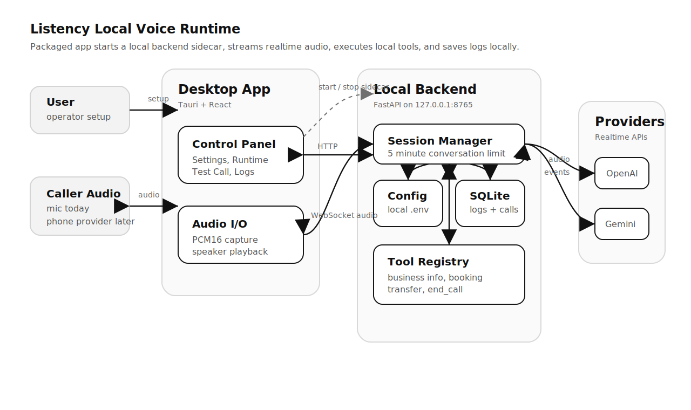

<p align="center">
  
</p>

<h1 align="center">Listency</h1>

<p align="center">
  Local-first, open-source desktop app for building and testing AI voice agents for small businesses.
</p>

<p align="center">
  
  <a href="https://github.com/Talen-520/Listency/actions/workflows/windows-packaged-smoke.yml">
    
  </a>
  <a href="https://github.com/Talen-520/Listency/actions/workflows/macos-packaged-smoke.yml">
    
  </a>
  
  
  
</p>

Listency runs a local desktop control panel and a thin local backend. In
packaged builds, the desktop app starts a bundled backend sidecar automatically
and stops it when the app closes. Packaged builds also include the cloudflared
connector used by automatic phone setup. Users can save provider API keys,
enter business information, edit an agent prompt, enable local tools, run
microphone test calls, and inspect transcripts, tool calls, and provider
events.

> Status: early MVP / alpha. The current project is intended for local
> development and testing, not production phone deployment.

## Interface Preview

Click a theme below to expand the preview. The image itself opens the full-size
asset.

<details open>
  <summary><strong>Dark Theme</strong></summary>
  <br />
  <a href="assets/ui%20dark.png">
    
  </a>
</details>

<details>
  <summary><strong>Light Theme</strong></summary>
  <br />
  <a href="assets/ui%20light.png">
    
  </a>
</details>

## Current MVP

What works today:

- Tauri + React desktop UI with Tailwind CSS and shadcn-style components.
- Black/white light and dark themes with Inter bundled locally.
- Auto-started local Python + FastAPI backend on `127.0.0.1:8765`.
- macOS and Windows packaged app smoke tests for backend startup, local API
  access, and backend shutdown when the app closes.
- Local `.env` provider key storage editable from Settings.
- Local SQLite session, transcript, tool-call, and app-event storage.
- OpenAI Realtime microphone-to-speaker Test Call using `gpt-realtime-2` by default.
- Gemini Live microphone-to-speaker Test Call.
- Animated Runtime provider panels for selecting OpenAI Realtime or Gemini Live.
- Provider-specific voice selection and local storage for OpenAI Realtime and Gemini Live.
- On-demand voice previews for OpenAI and Gemini voices, cached locally after first playback.
- Shared brand icon for the desktop UI, browser favicon, and Tauri app bundles.
- Provider-specific mono PCM16 input: 24 kHz for OpenAI Realtime and 16 kHz for Gemini Live.
- OpenAI Realtime and Gemini Live transcript capture and local tool calling.
- OpenAI Realtime sessions use low-effort reasoning by default for voice latency.
- Built-in tools for business info lookup, booking capture, transfer request
  logging, customer request logging, and AI-ended calls.
- Logs view with 24h / 7 days / 30 days filtering, JSON export, and per-session transcript, tool call, and event detail overlays.
- Settings data controls for pruning records older than 30 days or clearing local logs.
- Five-minute maximum duration for each active AI conversation.
- Phone setup preview with Twilio/Telnyx configuration, automatic public
  connection controls, Advanced custom URL mode, and Twilio inbound media stream
  bridge scaffolding.
- Bundled cloudflared connector for packaged macOS and Windows automatic phone
  setup.

Planned next:

- Complete real phone provider hardening and clean Twilio/Telnyx user testing.
- Pipeline mode with separate STT, LLM, and TTS providers.
- More complete booking and business workflow tools.
- Signed macOS and Windows installers.

## How It Works

<p align="center">
  <a href="assets/how-it-works.svg">
    
  </a>
</p>

The backend intentionally stays thin: session management, local config loading,
tool callbacks, and log persistence. Provider calls happen only when a Test Call
or future inbound phone call starts an AI session.

## One Click Start

This is the intended path for general or non-technical users.

1. Download a packaged Listency build.
2. Open the Listency desktop app.
3. Add OpenAI and/or Gemini API keys in Settings.
4. Choose a provider, model, and voice.
5. Fill in Business Info and Agent prompt.
6. Enable the tools the agent should use.
7. Start Runtime, then use Test Call to speak with the agent.
8. Review transcripts, tool calls, and app events in Logs.
9. Export Logs as JSON or use Settings to prune/clear local log data.

Packaged builds include the backend sidecar and the cloudflared connector, so
users do not need Python, Node, pnpm, Rust, cloudflared, or a terminal. The app
writes local configuration files for them and keeps provider keys in the local
`.env`.

> Release installers are still planned. Current alpha macOS and Windows build
> artifacts are produced by GitHub Actions for testing.

### macOS Alpha Artifact

The macOS GitHub Actions artifact is not signed or notarized yet. For alpha
testing, download the `listency-macos-*` artifact, open the artifact folder, then
extract `Listency-macos.zip` and open the extracted `Listency.app`.

If macOS shows `"Listency" is damaged and can't be opened`, it is Gatekeeper
blocking an unsigned downloaded app. For local alpha testing only, remove the
download quarantine flag:

```bash
xattr -dr com.apple.quarantine /path/to/Listency.app
```

This should be replaced by Developer ID signing and Apple notarization before
publishing builds for non-technical users.

## Developer Requirements

- Python 3.11+
- Node.js with Corepack enabled
- pnpm
- Rust and Cargo for the Tauri shell
- PyInstaller when building distributable sidecar bundles

## Developer Quick Start

Install backend dependencies:

```bash
cd app/backend
python3 -m venv .venv
source .venv/bin/activate
pip install -r requirements.txt
```

You can seed a local `.env` manually, or just enter keys in Settings after the
app starts. The backend creates default env files when needed.

```bash
cp .env.example .env

OPENAI_API_KEY=
GEMINI_API_KEY=
OPENAI_REALTIME_MODEL=gpt-realtime-2
GEMINI_LIVE_MODEL=gemini-3.1-flash-live-preview
OPENAI_REALTIME_MOCK=false
DEFAULT_REALTIME_PROVIDER=openai
OPENAI_DEFAULT_VOICE=
GEMINI_DEFAULT_VOICE=
DEFAULT_VOICE=
```

Install desktop dependencies:

```bash
cd app/desktop
corepack enable
pnpm install
```

Run the native desktop shell:

```bash
cd app/desktop
pnpm run tauri:dev
```

The Tauri shell checks `127.0.0.1:8765` and starts a local backend automatically
when no backend is already running. During development, it falls back to
`app/backend/.venv` when no bundled sidecar is present. In packaged builds, it
prefers the bundled `listency-backend` sidecar and passes the bundled
cloudflared connector path to the backend when present.

For browser-only frontend development, start the backend manually:

```bash
cd app/backend
source .venv/bin/activate
uvicorn voice_agent.main:app --host 127.0.0.1 --port 8765 --reload
```

Then run the Vite frontend:

```bash
cd app/desktop
pnpm run dev
```

The frontend dev server uses:

```text
http://127.0.0.1:5173/
```

Build a distributable local app with bundled backend and cloudflared sidecars:

```bash
cd app/backend
.venv/bin/python -m pip install pyinstaller

cd ../desktop
pnpm run tauri:build:sidecar
```

Use `tauri:build:sidecar` for local app bundles that a user can open without
installing Python, Node, pnpm, Rust, or cloudflared. The sidecar build writes
target-triple-specific backend and cloudflared binaries under
`app/desktop/src-tauri/binaries/`, which is bundled into the Tauri app
resources. When the app closes, the Tauri launcher shuts down the backend child
process it started.

Build only the Tauri shell without rebuilding the sidecar:

```bash
cd app/desktop
pnpm run tauri:build
```

macOS and Windows packaged smoke are checked in GitHub Actions on pushes and
pull requests to `main`. The workflows build the backend sidecar, run the
clean-data sidecar smoke test, download cloudflared for the runner platform,
build the Tauri app, launch the packaged desktop app, verify backend
health/CORS, close the app, and verify the backend shuts down.

For macOS artifact testing, use `Listency-macos.zip` from the
`listency-macos-*` workflow artifact, extract it, and open `Listency.app`.

For Windows artifact testing, use either the NSIS installer under
`bundle/nsis/` or the generated `portable/Listency.exe`. Do not run the raw
`target/release/*.exe` by itself; it does not carry the backend sidecar next to
the executable and will show the backend as offline on a clean machine.

## Local Workflow

1. Open Listency, or run `pnpm run tauri:dev` during development.
2. Let the desktop shell start or reuse the local backend.
3. Add provider API keys in Settings.
4. Fill in Business Profile and Agent prompt.
5. Enable the tools needed for the session.
6. Start Runtime.
7. Start a Test Call and speak through the microphone.
8. Review transcripts, tool calls, and app events in Logs.
9. Download JSON log exports from Logs or clean old records from Settings.

## Project Structure

```text
app/backend/
  voice_agent/
    config/       local .env and path helpers
    core/         runtime and session lifecycle
    providers/    OpenAI Realtime and Gemini Live transports
    storage/      SQLite persistence
    tools/        local tool registry and built-in tools

app/desktop/
  public/         browser favicon and static frontend assets
  src/app/        shell and navigation
  src/assets/     UI brand icon source assets
  src/features/   page-level UI
  src/hooks/      app data, session detail, and realtime test side effects
  src/components/ shared UI components
  src/components/ui/
                  shadcn-style primitives
  src/lib/        API, types, audio, formatting, runtime helpers
  src-tauri/      native Tauri shell and generated bundle icons
  src-tauri/binaries/
                  generated backend sidecar target

update_logs/      commit-by-commit development notes
scripts/          local helper scripts
```

Agent-facing notes such as `AGENTS.md`, architecture notes, design notes, and
development scratch docs are kept locally in the ignored `agent/` directory and
are not part of the public repository.

## Local Data And Privacy

Listency is designed to run locally first:

- API keys are stored in a local `.env`.
- Session records are stored in local SQLite.
- Log data can be exported as JSON from Logs and pruned or cleared from Settings.
- Voice preview audio is cached locally.
- Phone provider credentials are stored in the local `.env`. Automatic phone
  connection uses the bundled cloudflared connector and exposes only `/phone/*`
  provider webhooks; normal local app APIs remain blocked from the public tunnel
  host.
- Source/development mode stores local data under the repository `data/` directory.
- Packaged sidecar mode stores `.env`, SQLite, and preview cache under the
  operating system's app local data directory through `VOICE_AGENT_ROOT`.
- Business profile text and prompts stay local until sent to a selected AI
  provider during an active session.
- No hosted Listency backend is required for the current MVP.

Provider APIs may still receive audio, text, prompts, and tool results during
active sessions. Review each provider's data policy before using real customer
data.

## Development Commands

Backend tests:

```bash
cd app/backend
python -m unittest discover -s tests
```

Desktop build check:

```bash
cd app/desktop
pnpm run build
```

Regenerate browser and Tauri bundle icons:

```bash
node scripts/generate_tauri_icon.mjs
```

Build the backend sidecar for the current platform:

```bash
node scripts/build_backend_sidecar.mjs
```

Smoke test the packaged backend sidecar with a clean temporary data directory:

```bash
node scripts/smoke_packaged_backend.mjs
```

Backend WebSocket smoke test:

```bash
cd app/backend
source .venv/bin/activate
python ../../scripts/smoke_ws.py
```

## Contributing

This repository is early, so focused issues and small pull requests are easiest
to review. Please keep the local-first design intact, avoid committing secrets
or customer data, and update `README.md` or `update_logs/` when behavior
changes.

## License

Apache License 2.0. See `LICENSE`.
